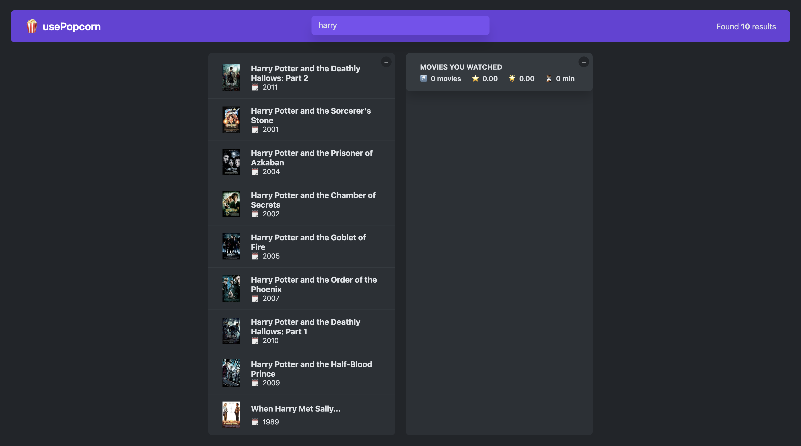
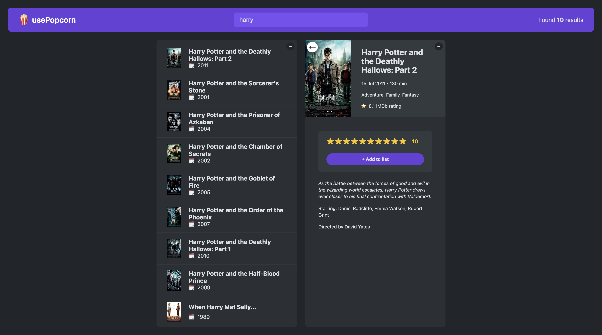
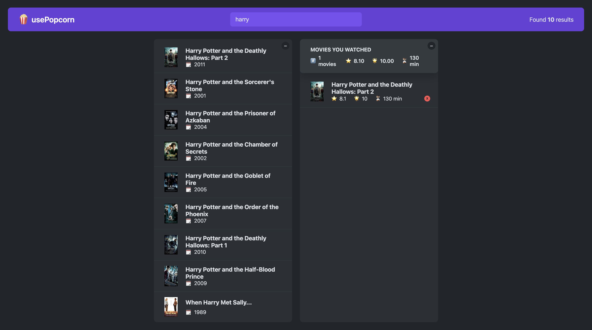

# usePopcorn 🍿

A sleek movie explorer app built with **React**, utilizing custom hooks to manage search, watchlist, and user interaction. Discover movies via the OMDb API, rate them, and build your own movie watchlist.

---

## 📸 Preview

### 🔍 Search interface


### 🎬 Movie list


### ⭐ Rate your movie


### 📂 Watchlist


---

## 🚀 Features

- Search for movies via the **OMDb API**
- View detailed information for each movie
- Add movies to a personal **watchlist**
- Rate and manage your watched movies
- Uses custom **React Hooks** for state management and effects

---

## 🛠 Technologies Used

- **React** (Create React App)
- **JavaScript (ES6+)**
- **CSS**
- **OMDb API**
- Custom Hooks (`useMovies`, `useLocalStorage`, `useKey`, etc.)

---

## 📁 Project Structure
```bash
usePopcorn/
├── public/
│   ├── index.html
│   └── …
├── src/
│   ├── App.js
│   ├── index.js
│   ├── index.css
│   ├── StarRating.js
│   ├── useMovies.js
│   ├── useKey.js
│   ├── useLocalStorageState.js
│   └── …
├── package.json
└── README.md
```

---

## 🔧 Getting Started

### 1. Clone the repo

```bash
git clone https://github.com/KuPiSzzz/usePopcorn.git
cd usePopcorn
```

### 2. Install dependencies

```bash
npm install
```

### 3. Start the React app

```bash
npm start
```

## 🌍 API Info

This project uses the OMDb API. To use it:
	1.	Go to http://www.omdbapi.com/apikey.aspx
	2.	Request a free API key
	3.	Replace the API key in your project wherever necessary (typically in useMovies.js)

